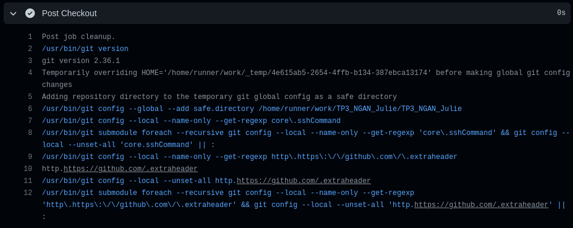

```
❯ python main.py
❯ python3 -m venv env
❯ source env/bin/activate
❯ python main.py
❯ pip install pipreqs
❯ pipreqs .
❯ python main.py

Pushing to docker hub

```

# Docker : wrapper en python qui récupère les données CurrentWeatherData de OpenWeatherMap (OWM)

Utilisation de Alpine 

docker login –u username # login

### Build image in docker hub using python 
We pull the image of python version of alpine : python:3.11.0a7-alpine3.15
We create a Dockerfile importing python with Alpine

We build the docker image with the Dockerfile:
docker build . -t efrei-devops-tp3:0.0.1

docker tag efrei-devops-tp3:0.0.1 juliengan/efrei-devops-tp3:0.0.1 # I tag it

docker push juliengan/efrei-devops-tp3:0.0.1 # I publish my image to dockerhub

### Push on dockerhub automatically using GitHub Actions
Create a new workflow docker-push.yml
with the actions : 
login/logout to DockerHub and build-push-action


checkout, 


### Run the API and Retrieve information in console

docker run --network host --env API_KEY="62bd02468799bb9568074245d9b8631e" efrei-devops-tp3:0.0.1 python main.py
curl "http://localhost:8081/?lat=5.902785&lon=102.754175"

## Build and deploy the docker image on Azure Container Instance and Registry

Create a main.yml in France central location and name the container instance deployed with student id. By pushing the repository, the GitBut Action will be triggered and the container instance created on Azure.


## Adding hadoling checking security before build and push on docker
<p>- name: Hadolint Action
      uses: hadolint/hadolint-action@v2.0.0
      with:
        dockerfile: Dockerfile</p>


#### Retrieve information  in console from Azure Container Registry
curl "http://devops-20180476.francecentral.azurecontainer.io/?lat=5.902785&lon=102.754175"


